# AAS-UNS Bridge

A daemonized integration service that ingests Asset Administration Shell (AAS) content and publishes it to both UNS retained topics and Sparkplug B for dual-plane discovery. Features a semantic hypervisor layer for validation, enrichment, and closed-loop control.

## Features

### Core Features

- **Dual Publication**: Publishes to both UNS retained topics and Sparkplug B simultaneously
- **Multiple AAS Sources**: AASX file watcher and AAS Repository REST API polling
- **ISA-95 Mapping**: Configurable hierarchy mapping for proper UNS topic structure
- **Change Detection**: Hash-based deduplication to avoid redundant publishes
- **Sparkplug Compliance**: Full NBIRTH/DBIRTH/NDEATH/DDEATH lifecycle support
- **Observability**: Prometheus metrics, structured logging, health endpoints

### Semantic Hypervisor

The semantic hypervisor transforms the bridge from a passive translator into an active semantic enforcement layer:

| Feature | Description |
|---------|-------------|
| **Semantic QoS Levels** | Three levels: sQoS 0 (raw pass-through), sQoS 1 (validated), sQoS 2 (enriched with MQTT v5 headers) |
| **Pre-publish Validation** | Enforce semantic IDs, value constraints (min/max/unit/pattern) |
| **Bidirectional Sync** | Command write-back to AAS repository with allowed/denied path patterns |
| **Pointer Mode** | ~90% payload reduction using hash references to semantic context |
| **Resolution Cache** | Sub-millisecond semantic context resolution with LRU caching |
| **Schema Drift Detection** | Detect metric additions, removals, and type changes |
| **Streaming Drift** | Half-Space Trees for real-time anomaly detection |
| **Asset Lifecycle** | Track online/stale/offline states with lifecycle events |
| **Fidelity Metrics** | Measure semantic information preservation across the translation |

## Architecture


### Architecture Overview

```mermaid
flowchart TB
    subgraph Entry["📥 Entry Points"]
        FW["AASFileHandler<br/><i>daemon.py</i><br/>watchdog events"]
        RC["AASRepoClient<br/><i>aas/repo_client.py</i><br/>REST polling"]
    end

    subgraph Ingestion["📦 Ingestion Layer"]
        L["load_aasx() / load_json()<br/><i>aas/loader.py</i>"]
        T["flatten_submodel()<br/><i>aas/traversal.py</i>"]
        CM[("ContextMetric[]<br/><i>domain/models.py</i><br/>frozen dataclass")]
    end

    subgraph Hypervisor["🔬 Semantic Hypervisor Layer"]
        direction TB
        subgraph Validation["sQoS Enforcement"]
            SV["SemanticValidator<br/><i>validation/semantic_validator.py</i>"]
        end
        subgraph DriftDetection["Drift Detection"]
            DD["DriftDetector<br/><i>state/drift_detector.py</i><br/>schema fingerprints"]
            SD["IncrementalDriftDetector<br/><i>state/streaming_drift.py</i><br/>Half-Space Trees"]
        end
        subgraph Tracking["Asset Tracking"]
            LT["AssetLifecycleTracker<br/><i>state/asset_lifecycle.py</i><br/>online/stale/offline"]
            FC["FidelityCalculator<br/><i>semantic/fidelity.py</i><br/>information-theoretic"]
        end
        subgraph Context["Semantic Context"]
            SRC["SemanticResolutionCache<br/><i>semantic/resolution_cache.py</i><br/>LRU + SQLite"]
        end
    end

    subgraph MappingLayer["🗺️ Mapping & Deduplication"]
        M["ISA95Mapper<br/><i>mapping/isa95.py</i><br/>→ AssetIdentity"]
        LPH["LastPublishedHashes<br/><i>state/last_published.py</i><br/>hash deduplication"]
    end

    subgraph Publishers["📤 Publication Layer"]
        subgraph UNS["UNS Publisher"]
            UP["UnsRetainedPublisher<br/><i>publishers/uns_retained.py</i>"]
            PM["Payload Modes:<br/>• inline (full metadata)<br/>• pointer (hash ref)<br/>• hybrid"]
            CP["ContextPublisher<br/><i>publishers/context_publisher.py</i><br/>UNS/Sys/Context/{dict}/{hash}"]
        end
        subgraph Sparkplug["Sparkplug B Publisher"]
            SP["SparkplugPublisher<br/><i>publishers/sparkplug.py</i>"]
            SL["Lifecycle:<br/>NBIRTH → DBIRTH →<br/>NDATA/DDATA →<br/>DDEATH → NDEATH"]
        end
    end

    subgraph Transport["🔌 Transport Layer"]
        MQTT["MqttClient<br/><i>mqtt/client.py</i><br/>paho v2.0 + MQTTv5"]
        Broker[("MQTT Broker<br/>(v5)")]
    end

    subgraph Bidirectional["↔️ Bidirectional Sync"]
        BS["BidirectionalSync<br/><i>sync/bidirectional.py</i><br/>.../cmd/{submodel}/{prop}"]
        AAS[("AAS Repository<br/>write-back")]
    end

    subgraph State["💾 State Persistence"]
        DB1[("aliases.db<br/>Sparkplug aliases")]
        DB2[("births.db<br/>BIRTH cache")]
        DB3[("hashes.db<br/>deduplication")]
        DB4[("drift.db<br/>fingerprints")]
        DB5[("lifecycle.db<br/>asset states")]
        DB6[("fidelity.db<br/>history")]
        DB7[("streaming_drift.db<br/>HST forest")]
        DB8[("semantic_cache.db<br/>contexts")]
    end

    subgraph Observability["📊 Observability"]
        MET["MetricsServer<br/><i>metrics.py</i><br/>Prometheus :9090"]
        HLT["HealthServer<br/><i>health.py</i><br/>liveness/readiness :8080"]
        LOG["setup_logging()<br/><i>logging.py</i><br/>structured JSON"]
    end

    %% Data Flow
    FW --> L
    RC --> L
    L --> T
    T --> CM

    CM --> SV
    CM --> DD
    CM --> SD
    SV --> FC
    DD --> LT
    SD --> SRC

    SRC --> M
    M --> LPH

    LPH --> UP
    LPH --> SP
    UP --> PM
    UP --> CP
    SP --> SL

    UP --> MQTT
    SP --> MQTT
    CP --> MQTT
    MQTT --> Broker

    Broker --> BS
    BS --> AAS

    %% State connections
    SP -.-> DB1
    SP -.-> DB2
    LPH -.-> DB3
    DD -.-> DB4
    LT -.-> DB5
    FC -.-> DB6
    SD -.-> DB7
    SRC -.-> DB8

    %% Observability connections
    UP -.-> MET
    SP -.-> MET
    SV -.-> MET
    DD -.-> MET
    LT -.-> MET

    %% Styling
    classDef entry fill:#e1f5fe,stroke:#01579b
    classDef ingestion fill:#f3e5f5,stroke:#7b1fa2
    classDef hypervisor fill:#fff3e0,stroke:#e65100
    classDef mapping fill:#e8f5e9,stroke:#2e7d32
    classDef publisher fill:#fce4ec,stroke:#c2185b
    classDef transport fill:#e3f2fd,stroke:#1565c0
    classDef state fill:#f5f5f5,stroke:#616161
    classDef observability fill:#fffde7,stroke:#f9a825

    class FW,RC entry
    class L,T,CM ingestion
    class SV,DD,SD,LT,FC,SRC hypervisor
    class M,LPH mapping
    class UP,PM,CP,SP,SL publisher
    class MQTT,Broker,BS,AAS transport
    class DB1,DB2,DB3,DB4,DB5,DB6,DB7,DB8 state
    class MET,HLT,LOG observability
```



## Quick Start

### Using Docker Compose

```bash
# Clone the repository
git clone https://github.com/hadijannat/aas-uns-bridge.git
cd aas-uns-bridge

# Copy and edit configuration
cp config/config.example.yaml docker/config/config.yaml
cp config/mappings.example.yaml docker/config/mappings.yaml

# Start the stack
cd docker
docker-compose up -d

# Copy AASX files to the watch directory
cp /path/to/your/*.aasx watch/

# View logs
docker-compose logs -f bridge
```

### Using pip

```bash
# Install the package
pip install aas-uns-bridge

# Copy configuration files
cp config/config.example.yaml config/config.yaml
cp config/mappings.example.yaml config/mappings.yaml

# Edit configuration for your environment
vi config/config.yaml

# Run the bridge
aas-uns-bridge run --config config/config.yaml --mappings config/mappings.yaml
```

## Configuration

### Basic Configuration

```yaml
mqtt:
  host: localhost
  port: 1883
  client_id: aas-uns-bridge
  # username: bridge_user
  # password: secret
  use_tls: false
  keepalive: 60
  reconnect_delay_min: 1.0
  reconnect_delay_max: 120.0

uns:
  enabled: true
  root_topic: ""  # Optional prefix
  qos: 1
  retain: true

sparkplug:
  enabled: true
  group_id: AAS
  edge_node_id: Bridge
  device_prefix: ""
  qos: 0

file_watcher:
  enabled: true
  watch_dir: ./watch
  patterns:
    - "*.aasx"
    - "*.json"
  recursive: true
  debounce_seconds: 2.0

repo_client:
  enabled: false
  base_url: http://localhost:8080
  poll_interval_seconds: 60.0
  timeout_seconds: 30.0

state:
  db_path: ./state/bridge.db
  cache_births: true
  deduplicate_publishes: true

observability:
  log_level: INFO
  log_format: console  # or "json"
  metrics_port: 9090
  health_port: 8080
```

### Semantic Enforcement Configuration

Control validation and semantic QoS levels:

```yaml
semantic:
  # Semantic QoS level:
  #   0 = Raw pass-through (no validation/enrichment)
  #   1 = Validated (schema validation before publish)
  #   2 = Enriched (validated + MQTT v5 User Properties)
  sqos_level: 0

  # Include metadata in MQTT v5 User Properties (headers)
  use_user_properties: false

  # Keep metadata in JSON payload for non-v5 subscribers
  payload_metadata_fallback: true

  # Pre-publish validation
  validation:
    enabled: false
    enforce_semantic_ids: true
    required_for_types:
      - Property
      - Range
    reject_invalid: false
    # Value constraints by semantic ID
    value_constraints:
      "0173-1#02-AAO677#002":  # Temperature
        min: -40
        max: 120
        unit: "degC"
      "0173-1#02-AAH880#002":  # Serial number
        pattern: "^[A-Z]{2}[0-9]{6}$"

  # Schema drift detection
  drift:
    enabled: false
    track_additions: true
    track_removals: true
    track_type_changes: true
    alert_topic_template: "UNS/Sys/DriftAlerts/{asset_id}"

  # Asset lifecycle tracking
  lifecycle:
    enabled: false
    stale_threshold_seconds: 300
    clear_retained_on_offline: false
    publish_lifecycle_events: true
```

### Hypervisor Configuration

Advanced features for semantic context management:

```yaml
hypervisor:
  # Semantic resolution cache
  resolution_cache:
    enabled: false
    max_memory_entries: 10000
    preload_on_startup: true

  # Pointer mode: ~90% payload reduction
  pointer:
    enabled: false
    mode: inline  # "inline", "pointer", or "hybrid"
    publish_context_topics: true
    context_topic_prefix: "UNS/Sys/Context"

  # Information-theoretic fidelity metrics
  fidelity:
    enabled: false
    alert_threshold: 0.7
    weights:
      structural: 0.3
      semantic: 0.5
      entropy: 0.2

  # Streaming drift detection with Half-Space Trees
  incremental_drift:
    enabled: false
    window_size: 1000
    num_trees: 25
    severity_thresholds:
      low: 0.3
      medium: 0.5
      high: 0.7
      critical: 0.9

  # Bidirectional sync: command write-back
  bidirectional:
    enabled: false
    aas_repository_url: http://localhost:8080
    command_topic_suffix: /cmd
    allowed_write_patterns:
      - "Setpoints/*"
      - "Configuration/*"
    denied_write_patterns:
      - "readonly/*"
      - "Identification/*"
    validate_before_write: true
    publish_confirmations: true
```

### Mappings Configuration

Maps AAS globalAssetId to ISA-95 hierarchy:

```yaml
default:
  enterprise: DefaultEnterprise
  site: DefaultSite
  area: DefaultArea
  line: DefaultLine

assets:
  "https://example.com/aas/robot-arm-001":
    enterprise: AcmeCorp
    site: PlantA
    area: Packaging
    line: Line1
    asset: RobotArm001

patterns:
  - pattern: "https://example.com/aas/robot-*"
    enterprise: AcmeCorp
    site: PlantA
    area: Robotics
    line: Assembly
```

## Topic Structure

### UNS Retained Topics

Data topics for asset context:

```
{enterprise}/{site}/{area}/{line}/{asset}/context/{submodel}/{element_path}
```

Example:
```
AcmeCorp/PlantA/Assembly/Line1/Robot001/context/TechnicalData/GeneralInfo/ManufacturerName
```

Payload (sQoS 0 - inline mode):
```json
{
  "value": "Acme Robotics",
  "timestamp": 1706369400000,
  "semanticId": "0173-1#02-AAO677#002",
  "unit": null,
  "source": "aas-uns-bridge",
  "aasUri": "/watch/robot-001.aasx"
}
```

Payload (pointer mode):
```json
{
  "value": "Acme Robotics",
  "timestamp": 1706369400000,
  "ctx": "a1b2c3d4"
}
```

### Sparkplug B Topics

```
spBv1.0/{group_id}/NBIRTH/{edge_node_id}
spBv1.0/{group_id}/DBIRTH/{edge_node_id}/{device_id}
spBv1.0/{group_id}/DDATA/{edge_node_id}/{device_id}
spBv1.0/{group_id}/NDEATH/{edge_node_id}
```

### Command Topics (Bidirectional Sync)

Write commands back to AAS repository:

```
{enterprise}/{site}/{area}/{line}/{asset}/context/{submodel}/{property}/cmd
```

Payload:
```json
{
  "value": 75.5,
  "timestamp": 1706369400000,
  "correlation_id": "cmd-123"
}
```

Confirmation response (published to original topic):
```json
{
  "ack": true,
  "correlation_id": "cmd-123",
  "timestamp": 1706369401000
}
```

### System Topics

**Context Topics** (Pointer mode semantic dictionaries):
```
UNS/Sys/Context/{dictionary}/{hash}
```

Payload:
```json
{
  "semanticId": "0173-1#02-AAO677#002",
  "unit": "degC",
  "source": "aas-uns-bridge",
  "aasUri": "/watch/robot-001.aasx"
}
```

**Drift Alerts**:
```
UNS/Sys/DriftAlerts/{asset_id}
```

Payload:
```json
{
  "type": "metric_added",
  "asset_id": "robot-001",
  "metric_path": "TechnicalData/NewProperty",
  "timestamp": 1706369400000,
  "severity": "medium"
}
```

**Lifecycle Events**:
```
UNS/Sys/Lifecycle/{asset_id}
```

Payload:
```json
{
  "state": "stale",
  "previous_state": "online",
  "asset_id": "robot-001",
  "timestamp": 1706369400000,
  "stale_duration_seconds": 305
}
```

## CLI Commands

```bash
# Run the daemon
aas-uns-bridge run [--config PATH] [--mappings PATH]

# Validate configuration
aas-uns-bridge validate [--config PATH]

# Check status of running instance
aas-uns-bridge status

# Show version
aas-uns-bridge version
```

## Observability

### Health Endpoints

| Endpoint | Purpose |
|----------|---------|
| `GET /health` | Full health status (JSON) |
| `GET /ready` | Kubernetes readiness probe |
| `GET /live` | Kubernetes liveness probe |

### Prometheus Metrics

Available at `http://localhost:9090/metrics`:

**Core Metrics**:
| Metric | Type | Description |
|--------|------|-------------|
| `aas_bridge_aas_loaded_total` | Counter | AAS files loaded |
| `aas_bridge_metrics_flattened_total` | Counter | Metrics extracted |
| `aas_bridge_uns_published_total` | Counter | UNS messages published |
| `aas_bridge_sparkplug_births_total` | Counter | Sparkplug births sent |
| `aas_bridge_mqtt_connected` | Gauge | Connection status |

**Semantic Validation Metrics**:
| Metric | Type | Description |
|--------|------|-------------|
| `semantic_validation_passed_total` | Counter | Metrics passing validation |
| `semantic_validation_failed_total` | Counter | Metrics failing validation |
| `semantic_validation_warnings_total` | Counter | Validation warnings issued |

**Cache Metrics**:
| Metric | Type | Description |
|--------|------|-------------|
| `semantic_cache_hits_total` | Counter | Cache hits |
| `semantic_cache_misses_total` | Counter | Cache misses |
| `semantic_cache_size` | Gauge | Current cache entries |

**Drift Detection Metrics**:
| Metric | Type | Description |
|--------|------|-------------|
| `streaming_drift_anomalies_total` | Counter | Anomalies detected (by severity) |
| `streaming_drift_window_size` | Gauge | Current reference window size |

**Lifecycle Metrics**:
| Metric | Type | Description |
|--------|------|-------------|
| `asset_lifecycle_online` | Gauge | Assets currently online |
| `asset_lifecycle_stale` | Gauge | Assets currently stale |
| `asset_lifecycle_offline` | Gauge | Assets currently offline |
| `asset_lifecycle_transitions_total` | Counter | State transitions (by type) |

**Fidelity Metrics**:
| Metric | Type | Description |
|--------|------|-------------|
| `fidelity_score_structural` | Gauge | Structural fidelity (0-1) |
| `fidelity_score_semantic` | Gauge | Semantic fidelity (0-1) |
| `fidelity_score_overall` | Gauge | Weighted overall fidelity |

## Development

```bash
# Create virtual environment
python -m venv venv
source venv/bin/activate

# Install with dev dependencies
pip install -e ".[dev]"

# Generate protobuf bindings
make proto

# Run tests
make test

# Run linting
make lint

# Format code
make format
```

## License

MIT License - see LICENSE file for details.
