# AAS-UNS Bridge

[](https://github.com/hadijannat/aas-uns-bridge/actions/workflows/ci.yml)
[](https://opensource.org/licenses/MIT)
[](https://www.python.org/downloads/)
[](https://sparkplug.eclipse.org/)

A production-ready integration service that ingests Asset Administration Shell (AAS) content and publishes to dual MQTT planes: **UNS retained topics** for late-subscriber discovery and **Sparkplug B** for SCADA/historian integration.

## Table of Contents

- [Features](#features)
- [Architecture](#architecture)
- [Quick Start](#quick-start)
- [Configuration](#configuration)
- [Topic Structure](#topic-structure)
- [Testing & Compliance](#testing--compliance)
- [CLI Commands](#cli-commands)
- [Observability](#observability)
- [Development](#development)
- [License](#license)

## Features

### Core Capabilities

| Feature | Description |
|---------|-------------|
| **Dual-Plane Publishing** | Simultaneous publication to UNS (retained JSON) and Sparkplug B (protobuf) |
| **AAS Ingestion** | File watcher for AASX/JSON files + REST API polling from AAS repositories |
| **ISA-95 Mapping** | Configurable globalAssetId → ISA-95 hierarchy for proper UNS topic structure |
| **Change Detection** | Hash-based deduplication to avoid redundant publishes |
| **Sparkplug 3.0 Compliant** | Full lifecycle support (NBIRTH/DBIRTH/DDATA/DDEATH/NDEATH), QoS=0, retain=false |
| **State Persistence** | SQLite-backed alias database and birth cache survive restarts |
| **Reconnection Handling** | Automatic reconnect with rebirth sequence on broker disconnect |

### Semantic Hypervisor

Advanced features for semantic enforcement and monitoring:

| Feature | Description |
|---------|-------------|
| **Semantic QoS Levels** | sQoS 0 (pass-through), sQoS 1 (validated), sQoS 2 (enriched with MQTT v5 headers) |
| **Pre-publish Validation** | Enforce semantic IDs, value constraints (min/max/unit/pattern) |
| **Bidirectional Sync** | Command write-back to AAS repository with allowed/denied path patterns |
| **Pointer Mode** | ~90% payload reduction using hash references to semantic context |
| **Schema Drift Detection** | Detect metric additions, removals, and type changes |
| **Streaming Drift** | Half-Space Trees for real-time anomaly detection |
| **Asset Lifecycle** | Track online/stale/offline states with lifecycle events |
| **Fidelity Metrics** | Measure semantic information preservation across translation |

## Architecture


### Data Flow

```
AAS Sources → Loader → Traversal → Semantic Hypervisor → ISA-95 Mapper → Publishers → MQTT Broker
     ↓           ↓          ↓              ↓                   ↓              ↓
  AASX/JSON   BaSyx SDK  ContextMetric  Validation      AssetIdentity    UNS + Sparkplug
```

### Component Overview


<details>
<summary>View Full Architecture Diagram</summary>



</details>

```mermaid
flowchart TB
    subgraph Entry["📥 Entry Points"]
        FW["AASFileHandler<br/><i>daemon.py</i>"]
        RC["AASRepoClient<br/><i>aas/repo_client.py</i>"]
    end

    subgraph Ingestion["📦 Ingestion Layer"]
        L["load_aasx() / load_json()<br/><i>aas/loader.py</i>"]
        T["flatten_submodel()<br/><i>aas/traversal.py</i>"]
        CM[("ContextMetric[]")]
    end

    subgraph Hypervisor["🔬 Semantic Hypervisor"]
        SV["SemanticValidator"]
        DD["DriftDetector"]
        LT["LifecycleTracker"]
    end

    subgraph Publishers["📤 Publishers"]
        UP["UnsRetainedPublisher<br/>retain=true, JSON"]
        SP["SparkplugPublisher<br/>retain=false, protobuf"]
    end

    subgraph State["💾 State"]
        DB1[("aliases.db")]
        DB2[("births.db")]
        DB3[("hashes.db")]
    end

    FW --> L --> T --> CM
    RC --> L
    CM --> SV --> DD --> LT
    LT --> UP & SP
    SP -.-> DB1 & DB2
    UP -.-> DB3
```

## Quick Start

### Prerequisites

- Python 3.11+
- MQTT Broker (Mosquitto, EMQX, or HiveMQ)
- AAS files (AASX or JSON format)

### Option 1: Docker Compose (Recommended)

```bash
# Clone the repository
git clone https://github.com/hadijannat/aas-uns-bridge.git
cd aas-uns-bridge

# Start the full stack (bridge + Mosquitto)
docker compose -f docker/docker-compose.mosquitto.yml up -d

# Copy your AAS files to the watch directory
cp /path/to/your/*.aasx watch/

# View logs
docker compose -f docker/docker-compose.mosquitto.yml logs -f
```

### Option 2: pip Install

```bash
# Install the package
pip install -e ".[dev]"

# Copy and configure
cp config/config.example.yaml config/config.yaml
cp config/mappings.example.yaml config/mappings.yaml

# Edit for your environment
vi config/config.yaml

# Run the bridge
aas-uns-bridge run --config config/config.yaml --mappings config/mappings.yaml
```

### Verify It's Working

```bash
# Subscribe to all UNS topics
mosquitto_sub -h localhost -t '#' -v

# Subscribe to Sparkplug topics
mosquitto_sub -h localhost -t 'spBv1.0/#' -v

# Check health endpoint
curl http://localhost:8080/health

# Check Prometheus metrics
curl http://localhost:9090/metrics
```

## Configuration

### Minimal Configuration

```yaml
mqtt:
  host: localhost
  port: 1883

uns:
  enabled: true
  retain: true

sparkplug:
  enabled: true
  group_id: AAS
  edge_node_id: Bridge

file_watcher:
  enabled: true
  watch_dir: ./watch
  patterns: ["*.aasx", "*.json"]
```

### Full Configuration Reference

<details>
<summary>View complete configuration options</summary>

```yaml
mqtt:
  host: localhost
  port: 1883
  client_id: aas-uns-bridge
  username: null
  password: null
  use_tls: false
  keepalive: 60
  reconnect_delay_min: 1.0
  reconnect_delay_max: 120.0

uns:
  enabled: true
  root_topic: ""
  qos: 1
  retain: true

sparkplug:
  enabled: true
  group_id: AAS
  edge_node_id: Bridge
  device_prefix: ""

file_watcher:
  enabled: true
  watch_dir: ./watch
  patterns: ["*.aasx", "*.json"]
  recursive: true
  debounce_seconds: 2.0

repo_client:
  enabled: false
  base_url: http://localhost:8080
  poll_interval_seconds: 60.0
  timeout_seconds: 30.0

state:
  db_path: ./state/bridge.db
  cache_births: true
  deduplicate_publishes: true

observability:
  log_level: INFO
  log_format: console  # or "json"
  metrics_port: 9090
  health_port: 8080

semantic:
  sqos_level: 0  # 0=raw, 1=validated, 2=enriched
  validation:
    enabled: false
    enforce_semantic_ids: true
  drift:
    enabled: false
  lifecycle:
    enabled: false
    stale_threshold_seconds: 300

hypervisor:
  resolution_cache:
    enabled: false
  pointer:
    enabled: false
    mode: inline  # inline, pointer, hybrid
  bidirectional:
    enabled: false
```

</details>

### ISA-95 Mappings

Map AAS globalAssetId to ISA-95 hierarchy:

```yaml
# config/mappings.yaml
default:
  enterprise: DefaultEnterprise
  site: DefaultSite
  area: DefaultArea
  line: DefaultLine

assets:
  "https://example.com/aas/robot-001":
    enterprise: AcmeCorp
    site: PlantA
    area: Assembly
    line: Line1
    asset: Robot001

patterns:
  - pattern: "https://example.com/aas/sensor-*"
    enterprise: AcmeCorp
    site: PlantA
    area: Sensors
```

## Topic Structure

### UNS Topics (Retained JSON)

```
{enterprise}/{site}/{area}/{line}/{asset}/context/{submodel}/{element_path}
```

**Example:**
```
AcmeCorp/PlantA/Assembly/Line1/Robot001/context/TechnicalData/Temperature
```

**Payload:**
```json
{
  "value": 25.5,
  "timestamp": 1706369400000,
  "semanticId": "0173-1#02-AAB381#001",
  "unit": "degC",
  "aasSource": "/watch/robot-001.aasx"
}
```

### Sparkplug B Topics

```
spBv1.0/{group_id}/NBIRTH/{edge_node_id}
spBv1.0/{group_id}/DBIRTH/{edge_node_id}/{device_id}
spBv1.0/{group_id}/DDATA/{edge_node_id}/{device_id}
spBv1.0/{group_id}/DDEATH/{edge_node_id}/{device_id}
spBv1.0/{group_id}/NDEATH/{edge_node_id}
```

**Sparkplug Compliance:**
- All messages use `QoS=0` (per Sparkplug 3.0 spec)
- All messages use `retain=false`
- NDEATH configured as Last Will & Testament (LWT)
- bdSeq increments on rebirth/reconnect
- Sequence numbers wrap 0-255

## Testing & Compliance

### Test Suites

| Suite | Count | Description |
|-------|-------|-------------|
| Unit Tests | 290+ | Core logic, models, traversal |
| Integration Tests | 20+ | MQTT broker interaction |
| E2E Tests | 15+ | Full pipeline validation |
| Sparkplug Compliance | 16 | QoS=0, retain=false enforcement |
| Soak Tests | 3 | 1h, 24h, 14-day endurance |

### Running Tests

```bash
# All unit tests
pytest tests/unit -v

# Integration tests (requires MQTT broker)
pytest tests/integration -v -m integration

# Sparkplug QoS compliance
pytest tests/unit/test_sparkplug_qos_compliance.py -v

# E2E Sparkplug compliance
pytest tests/e2e/test_sparkplug_e2e.py -v

# Generate JUnit XML reports
pytest tests/unit -v --junitxml=test-reports/unit-tests.xml
```

### Broker Interoperability Testing

Docker Compose files are provided for testing with multiple brokers:

```bash
# Mosquitto (default)
docker compose -f docker/docker-compose.mosquitto.yml up -d

# EMQX
docker compose -f docker/docker-compose.emqx.yml up -d

# HiveMQ CE
docker compose -f docker/docker-compose.hivemq.yml up -d

# Run tests against broker
TEST_MQTT_HOST=localhost TEST_MQTT_PORT=1883 pytest tests/integration -v
```

### TRL Evidence

Formal Technology Readiness Level (TRL) evidence is maintained in [`docs/trl/`](docs/trl/):

| Document | Purpose |
|----------|---------|
| [System Requirements](docs/trl/requirements/system-requirements-spec.md) | REQ-* functional requirements |
| [Verification Matrix](docs/trl/requirements/verification-matrix.md) | Requirement → Test mapping |
| [Sparkplug Checklist](docs/trl/compliance/sparkplug-checklist.md) | Sparkplug 3.0 compliance |
| [Broker Matrix](docs/trl/interoperability/broker-matrix.md) | Multi-broker test results |
| [Soak Test Template](docs/trl/operational/soak-test-template.md) | 14-day endurance log |

## CLI Commands

```bash
# Run the daemon
aas-uns-bridge run [--config PATH] [--mappings PATH]

# Validate configuration
aas-uns-bridge validate [--config PATH]

# Check status
aas-uns-bridge status

# Show version
aas-uns-bridge version
```

## Observability

### Health Endpoints

| Endpoint | Purpose |
|----------|---------|
| `GET /health` | Full health status (JSON) |
| `GET /ready` | Kubernetes readiness probe |
| `GET /live` | Kubernetes liveness probe |

### Prometheus Metrics

Available at `http://localhost:9090/metrics`:

| Metric | Type | Description |
|--------|------|-------------|
| `aas_bridge_aas_loaded_total` | Counter | AAS files loaded |
| `aas_bridge_uns_published_total` | Counter | UNS messages published |
| `aas_bridge_sparkplug_births_total` | Counter | Sparkplug births sent |
| `aas_bridge_mqtt_connected` | Gauge | Connection status (0/1) |
| `aas_bridge_active_devices` | Gauge | Devices with active DBIRTH |
| `semantic_validation_passed_total` | Counter | Metrics passing validation |
| `streaming_drift_anomalies_total` | Counter | Anomalies detected |

### Grafana Dashboard

Import the dashboard from `monitoring/grafana/dashboard.json` for visualization.

## Development

### Setup

```bash
# Clone and setup
git clone https://github.com/hadijannat/aas-uns-bridge.git
cd aas-uns-bridge
python -m venv venv
source venv/bin/activate

# Install with dev dependencies
pip install -e ".[dev]"

# Generate protobuf bindings (optional)
make proto
```

### Common Commands

```bash
# Run tests
make test

# Run linting
make lint

# Format code
make format

# Type checking
make typecheck

# Full CI check
make lint && make test
```

### Project Structure

```
aas-uns-bridge/
├── src/aas_uns_bridge/
│   ├── aas/           # AAS loading and traversal
│   ├── domain/        # Core models (ContextMetric, AssetIdentity)
│   ├── mapping/       # ISA-95 mapping
│   ├── mqtt/          # MQTT client wrapper
│   ├── publishers/    # UNS and Sparkplug publishers
│   ├── semantic/      # Validation, fidelity, resolution cache
│   ├── state/         # Persistence (aliases, births, hashes)
│   └── daemon.py      # Main entry point
├── tests/
│   ├── unit/          # Unit tests
│   ├── integration/   # Integration tests
│   ├── e2e/           # End-to-end tests
│   └── soak/          # Endurance tests
├── config/            # Example configurations
├── docker/            # Docker Compose files
├── docs/trl/          # TRL evidence pack
└── proto/             # Sparkplug protobuf definitions
```

## License

MIT License - see [LICENSE](LICENSE) for details.

---

**Maintained by:** [hadijannat](https://github.com/hadijannat)

**Related Standards:**
- [Asset Administration Shell](https://www.plattform-i40.de/SiteGlobals/IP/Forms/Lists/aas/aas.html)
- [Eclipse Sparkplug](https://sparkplug.eclipse.org/)
- [ISA-95](https://www.isa.org/standards-and-publications/isa-standards/isa-standards-committees/isa95)
